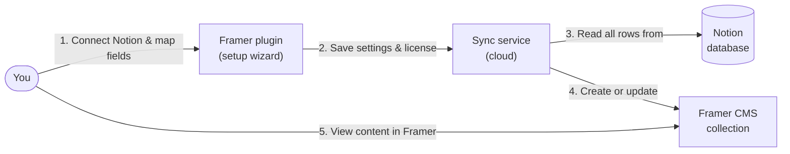
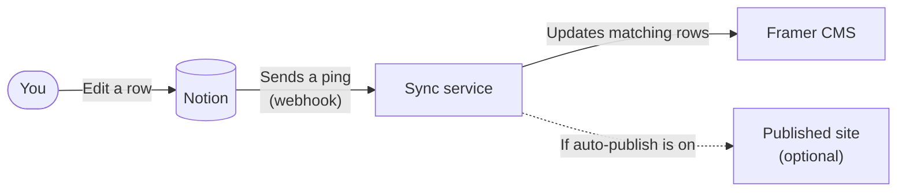
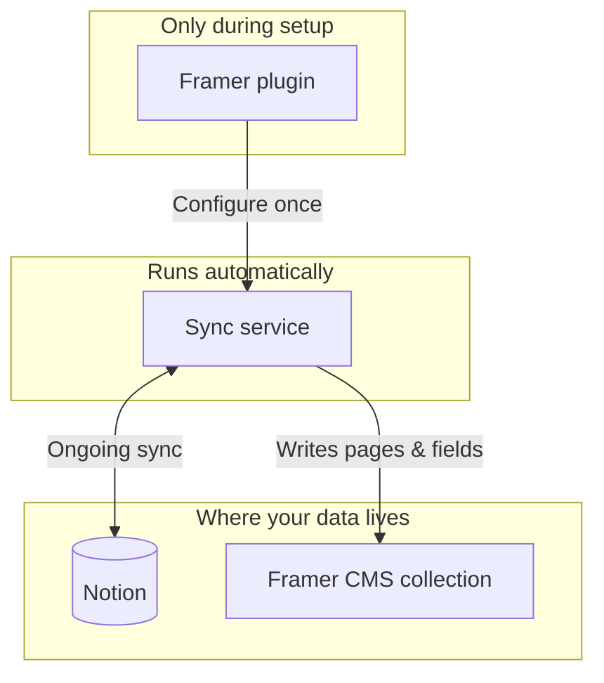
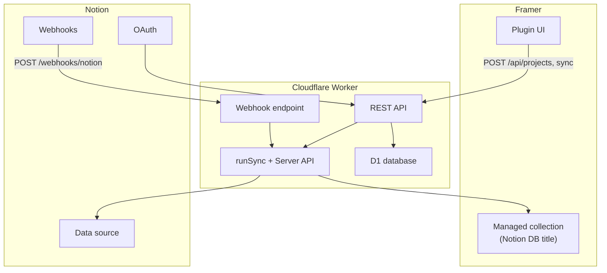

# Architecture & process

> **Note:** Everything below describes the **current pre-pivot V1** (plugin wizard + HMAC license). The target **PublishFlow** architecture — web dashboard, Google login, MoR billing (Lemon Squeezy or Polar) — is in **[PIVOT.md](./PIVOT.md)**. Your console checklist: **[MANUAL_CHECKLIST.md](./MANUAL_CHECKLIST.md)**.

Notion → Framer CMS Sync (V1) is a monorepo with three packages: a **Framer plugin** (setup UI), a **Cloudflare Worker** (API, webhooks, headless sync), and **shared** code (types, Notion fetch, transforms, licensing).

The core idea: **all data sync runs on the server** via the [Framer Server API](https://www.framer.com/developers/server-api-introduction). The plugin configures the connection; it does not own the CMS collection that receives Notion rows.

---

## Target architecture (PublishFlow)

The product is pivoting to a **Kitful-style** model: the **web app is the product**; the Framer plugin becomes a thin connector in a later phase.

| Current V1 | Target (PublishFlow) |
| ---------- | -------------------- |
| Full setup wizard in plugin | Setup in **web dashboard** (`packages/web`) |
| HMAC license key per project | **Google OAuth** login + **MoR subscription** (LS or Polar) |
| Open `/api/projects/:id` without auth | Session cookie; projects scoped by `customer_id` |
| Sync triggered inline on webhook | **Cloudflare Queue** for `runSync` |

**Login:** User opens the web app → **Continue with Google** (same UX as Kitful). Worker handles OAuth and sets a signed `pf_session` cookie. Notion OAuth remains separate — it connects the content source in the dashboard.

**Billing:** MoR webhooks upsert a `customers` row; login email must match an active subscription. Provider TBD (Lemon Squeezy or Polar). No license-key login, no Firebase.

**Sync:** `runSync`, Server API collection ownership, and Notion webhooks stay the same in principle. See [PIVOT.md](./PIVOT.md) for phases, schema, env vars, and diagrams.

---

## High-level overview (plain English)

You write in **Notion**. Visitors read your site on **Framer**. A small **sync service in the cloud** sits between them and keeps Framer’s CMS up to date.

You only open the **Framer plugin** to connect accounts, map fields, and turn auto-sync on. After that, most updates happen automatically when Notion changes.

### The three places involved

| Place | What it is | What you do there |
|-------|------------|-------------------|
| **Notion** | Your source of truth (database / pages) | Create and edit content |
| **Sync service** | Cloud app (Cloudflare Worker) | Nothing day-to-day — it runs in the background |
| **Framer** | Your website + CMS collections | View synced content; optional publish |

### One-time setup



**In short:** the plugin is the remote control; the sync service does the heavy lifting and writes into a CMS collection named like your Notion database.

### Day-to-day: when you edit Notion



**In short:** change Notion → cloud sync runs → Framer CMS updates → site can refresh if you enabled publish.

### Where the plugin fits (and where it does not)



The empty collection Framer creates when you add the plugin is **settings only**. Your real blog posts (or other rows) appear in the **separate** CMS collection the sync service manages.

### Technical view (for developers)

<details>
<summary>Click to expand — same system with implementation names</summary>



</details>

---

## Packages


| Package           | Role                                                                                                                                             |
| ----------------- | ------------------------------------------------------------------------------------------------------------------------------------------------ |
| `packages/plugin` | Framer plugin (`nfsync`): Notion OAuth wizard, field mapping, license, “Sync now”. Modes: `configureManagedCollection`, `syncManagedCollection`. |
| `packages/worker` | Hono app on Cloudflare Workers: REST API, Notion OAuth callback, webhooks, `runSync`, D1 persistence.                                            |
| `packages/shared` | Zod schemas, Notion API client (2025-09-03 data sources), Notion→Framer field mapping, `buildSyncPayload`, license verification.                 |


---

## Two collections (important)

Framer creates an **empty managed collection** when you add the plugin as a CMS source. That slot is only used for **plugin settings** (`projectId`, etc.).

The **real CMS data** lives in a separate collection created/found by the Worker via Server API, named after your **Notion database title** (e.g. “Blog Posts”). Open that collection in Framer to see synced items.


| Collection     | Created by                                    | Used for                     |
| -------------- | --------------------------------------------- | ---------------------------- |
| Plugin slot    | Framer when adding plugin source              | Wizard UI, plugin data keys  |
| API collection | `createManagedCollection(name)` on first sync | Notion rows, fields, publish |


Plugin collection id ≠ Server API collection id. Projects are keyed in D1 by **framer project URL + Notion data source**, not the plugin slot id.

---

## Data model (D1)


| Table                   | Purpose                                                                                                           |
| ----------------------- | ----------------------------------------------------------------------------------------------------------------- |
| `projects`              | Framer URL, Notion data source/database ids, collection name, slug field, auto-sync/publish flags, license status |
| `secrets`               | Encrypted Notion token, Framer API key, optional webhook verification token                                       |
| `field_mappings`        | Notion property → Framer field (type, ignore, transforms)                                                         |
| `sync_state`            | Last sync time, error, item count                                                                                 |
| `webhook_subscriptions` | Per-project webhook status                                                                                        |
| `setup_sessions`        | Short-lived OAuth setup (Notion token before project save)                                                        |
| `debounce_sync`         | Scheduled sync time per project (10s sliding debounce after last webhook)                                         |


Migrations: `packages/worker/migrations/0001_init.sql` (+ `0002` collection name, `0003` notion database id).

---

## Process 1: First-time setup (plugin)

```text
1. User opens plugin on a CMS source (configure mode)
2. Connect Notion → POST /api/setup-sessions → OAuth in browser
3. Pick Notion data source → GET .../data-sources, .../properties
4. Map fields, enter Framer project URL + Server API key + license
5. POST /api/projects
      → createOrUpdateProject (by project URL + data source)
      → registerNotionWebhook (status: awaiting_verification)
      → runSync (Server API)
6. Plugin stores projectId in plugin data; user opens CMS collection named like Notion DB
```

**License:** HMAC-signed key bound to Framer project URL (`LICENSE_SIGNING_SECRET`). Verified on connect and before sync.

**OAuth:** Notion redirect → `GET /oauth/notion/callback` → token encrypted into `setup_sessions`, then copied into `secrets` on project create.

---

## Process 2: Headless sync (`runSync`)

Used on: initial connect, `POST /api/projects/:id/sync`, webhook auto-sync, optional cron debounce.

```text
buildProjectSyncPayload
  → fetch Notion pages for data source
  → apply field_mappings → Framer items + fields

connect(framerProjectUrl, framerApiKey)
  → findOrCreateManagedCollection(notionDatabaseTitle)
  → setFields(mappings)
  → refresh collection handle (avoids "Expected a collection node")
  → removeItems (orphans)
  → addItems (all Notion rows)
  → optional publish() + deploy() if auto_publish

update sync_state + framer_collection_id in D1
```

Implementation: `packages/worker/src/sync/runSync.ts`, `framerCollection.ts`, `buildPayload.ts`.

Pattern matches [framer/server-api-examples/notion-automations-sync](https://github.com/framer/server-api-examples/tree/main/examples/notion-automations-sync).

---

## Process 3: Auto-sync (Notion webhooks)

```text
Notion POST /webhooks/notion
  → verification_token? → store token in D1 + show in plugin Status (copy), 200 OK
  → else parse events → match data_source_id / database_id
  → findProjectsByNotionSource → scheduleDebounceSync (+10s, extended on each event)
  → waitUntil(runImmediateSyncs) after quiet window (no new events for 10s)
  → runSync per project (if auto_sync + active license)
```


| Endpoint           | Method | Notes                               |
| ------------------ | ------ | ----------------------------------- |
| `/webhooks/notion` | POST   | Notion events + verification        |
| `/webhooks/notion` | GET    | Health message only (browser check) |
| `/health`          | GET    | Worker alive                        |


**Local dev:** Notion cannot reach `localhost`. Use a tunnel, e.g. `npm run tunnel` → `https://….trycloudflare.com/webhooks/notion`.

**Verification:** Notion POSTs `verification_token`. The Worker stores it in D1, and the plugin Status page shows the token with a **Copy** button until cleared. Paste into Notion → Integration → Webhooks → Verify.

**Cron:** `*/1 * * * *` runs `processDebouncedSyncs` for production; local `wrangler dev` also uses `waitUntil` for faster feedback.

---

## API routes (Worker)


| Route                                                     | Description                                |
| --------------------------------------------------------- | ------------------------------------------ |
| `POST /api/setup-sessions`                                | Start Notion OAuth                         |
| `GET /api/setup-sessions/:id/data-sources`                | List Notion DBs                            |
| `GET /api/setup-sessions/:id/data-sources/:id/properties` | Schema for mapping                         |
| `POST /api/license/verify`                                | Check license vs project URL               |
| `POST /api/projects`                                      | Save project + initial `runSync`           |
| `GET /api/projects/:id`                                   | Status panel data                          |
| `PATCH /api/projects/:id/publish`                         | Update auto-publish + publish mode         |
| `POST /api/projects/:id/sync`                             | Manual / “Sync now” server sync            |
| `GET /api/projects/:id/sync-payload`                      | Debug payload only (not used by plugin UI) |
| `GET/POST /oauth/notion/*`                                | OAuth start + callback                     |


---

## Plugin modes


| Mode                         | Behavior                                                                        |
| ---------------------------- | ------------------------------------------------------------------------------- |
| `configureManagedCollection` | Full wizard or status panel if `projectId` in plugin data                       |
| `syncManagedCollection`      | If `projectId` set → `POST /api/projects/:id/sync` then close; else show wizard |


Sync is always **Worker → Server API**. No editor-side `addItems` fallback.

---

## Security

- Notion + Framer API keys stored **encrypted** in D1 (`ENCRYPTION_KEY`)
- License gate on API sync paths
- Webhook `verification_token` stored in `secrets` for future HMAC checks (`X-Notion-Signature`)
- CORS open on `/api/`* for local plugin dev

---

## Environment


| Where                           | Variables                                                                              |
| ------------------------------- | -------------------------------------------------------------------------------------- |
| `packages/worker/.dev.vars`     | `NOTION_CLIENT_ID`, `NOTION_CLIENT_SECRET`, `ENCRYPTION_KEY`, `LICENSE_SIGNING_SECRET` |
| `packages/worker/wrangler.toml` | `WORKER_PUBLIC_URL`, `NOTION_REDIRECT_URI`, D1 binding                                 |
| `packages/plugin/.env`          | `VITE_API_BASE_URL` (e.g. `http://localhost:8787`)                                     |

### Local dev convenience scripts

- `npm run dev`: starts **worker + plugin + tunnel** in one terminal (via `concurrently`)
- `npm run tunnel`: starts `cloudflared` and prints a `trycloudflare.com` URL


---

## V1 limitations

- One Notion data source per project / Framer CMS collection name
- Plugin-managed collections via Server API only
- Notion webhooks: property/page level, not every block edit
- Image fields: external URLs where Framer supports them
- Quick tunnel URLs change on restart (use named tunnel or deployed worker for stable webhooks)

---

## Related docs

- [PIVOT.md](./PIVOT.md) — **target PublishFlow architecture** (web-first, Google auth, LS billing)
- [README.md](../README.md) — install, dev, deploy
- [SERVER_API_SPIKE.md](./SERVER_API_SPIKE.md) — why Server API owns the collection
- [ERROR_BOUNDARIES.md](./ERROR_BOUNDARIES.md) — sync error codes

