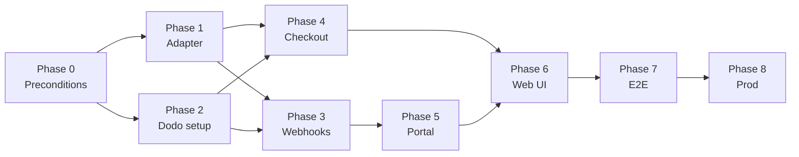

# Billing: Dodo + Polar dual-provider — phased plan

Per-project pricing ($9/project/month) stays as **`subscription_project_limit`** on `customers`. Polar and Dodo both write that field; only one provider is active per environment via `BILLING_PROVIDER`.

**Principle:** refactor Polar behind an adapter first, add Dodo second, cut over in sandbox before prod — no customer migration.

---

## Phase overview

| Phase | Name | Depends on | Est. | Cutover risk |
| ----- | ---- | ---------- | ---- | ------------ |
| **0** | Preconditions | — | 0.5d | — |
| **1** | Billing adapter (Polar unchanged) | 0 | 1–2d | None |
| **2** | Dodo dashboard + secrets | 0 | 0.5d | — |
| **3** | Dodo webhooks + quantity sync | 1, 2 | 2–3d | Low (sandbox only) |
| **4** | Checkout with quantity | 1, 2 | 1–2d | Medium |
| **5** | Customer portal | 3 | 0.5–1d | Low |
| **6** | Web UI + copy (provider-neutral) | 4, 5 | 1d | Low |
| **7** | Sandbox E2E + docs | 3–6 | 1d | — |
| **8** | Production cutover | 7 | 0.5d | **Go-live** |

**Total:** ~8–11 focused days.



---

## Phase 0 — Preconditions

**Goal:** Confirm model and inventory before code.

### Tasks

- [x] Confirm pricing: **$9/project/month**, quantity = project slots (1, 10, 100…).
- [x] Confirm entitlement rules unchanged:
  - `basic` → 1 project, 3 lifetime syncs, no auto-sync
  - `paid` → `subscription_project_limit` seats, unlimited syncs, auto-sync/publish
- [x] Confirm email rule: Google login email **must match** checkout email.
- [ ] Create Dodo Payments account (test + prod businesses).
- [x] List env vars to add (see Phase 2).

### Deliverables

- Pricing decision locked.
- Dodo dashboard access for whoever implements.

### Acceptance

- No open product questions on downgrade (keep current over-limit behavior: pause sync, don’t delete projects).

---

## Phase 1 — Billing adapter (Polar behavior unchanged)

**Goal:** Introduce provider abstraction; Polar is the only implementation. Zero user-facing change.

### Scope

| In | Out |
| -- | --- |
| `BillingAdapter` interface | Dodo code |
| `NormalizedSubscriptionEvent` type | Checkout API |
| `applyBillingEvents()` shared upsert | UI copy changes |
| Refactor `webhooks/billing.ts` router | |

### Files

```
packages/shared/src/billing.ts              # BillingProvider, NormalizedSubscriptionEvent
packages/worker/src/billing/
  adapter.ts           # interface + getBillingAdapter(env)
  apply-event.ts       # maps normalized events → customers table
  subscription-limit.ts
  polar-adapter.ts     # Polar verify + delegate
  polar.ts             # Polar event handlers (unchanged behavior)
packages/worker/src/webhooks/billing.ts   # dispatch by BILLING_PROVIDER
packages/worker/test/billing/
  polar.test.ts
  apply-event.test.ts
  adapter.test.ts
  test/webhooks/billing.test.ts
```

### Normalized event shape

```ts
{
  email: string
  billingProvider: "polar" | "dodo"
  externalCustomerId: string | null
  externalSubscriptionId: string | null
  subscriptionStatus: "active" | "inactive"
  planId: "paid" | undefined
  quantity: number | null          // → subscription_project_limit
  cancelAtPeriodEnd: boolean
  subscriptionEndsAt: string | null
}
```

Reuse `resolveSubscriptionProjectLimit()` from `subscription-limit.ts` (extracted from `polar.ts`).

### Acceptance criteria

- [x] `BILLING_PROVIDER=polar` — all existing Polar webhook tests pass.
- [x] `POST /webhooks/billing` returns 503 when provider/secret missing.
- [x] Shared `BillingProvider` + `NormalizedSubscriptionEvent` in `@knotcms/shared/billing.ts`.
- [x] Deploy to prod safe (refactor only).

---

## Phase 2 — Dodo dashboard + secrets

**Goal:** Dodo product and webhook configured; secrets in wrangler — no app code required yet.

### Dodo dashboard

1. **Product:** “KnotCMS Project”
   - Recurring monthly, **per-unit** pricing ($9/unit or your price)
   - Product ID → `DODO_PROJECT_PRODUCT_ID`
2. **Webhook:** `https://app.knotcms.com/webhooks/billing` (or staging URL)
   - Events: `subscription.active`, `subscription.updated`, `subscription.renewed`, `subscription.cancelled`, `subscription.expired`, `subscription.on_hold`
3. **Customer portal:** enabled (quantity changes + cancel)

### Env vars (`.dev.vars` + wrangler secrets)

```bash
# Active provider (staging/dev when testing Dodo)
BILLING_PROVIDER=dodo

# Dodo
DODO_API_KEY=
DODO_WEBHOOK_SECRET=
DODO_PROJECT_PRODUCT_ID=prod_...

# Optional static checkout (if not using API checkout in Phase 4)
DODO_CHECKOUT_URL_PAID=

# Optional portal (if not using API in Phase 5)
DODO_CUSTOMER_PORTAL_URL=

# Polar (keep for Phase 1 tests / fallback)
BILLING_WEBHOOK_SECRET=          # Polar
POLAR_PROJECT_PRODUCT_ID=
BILLING_CHECKOUT_URL_PAID=
BILLING_CUSTOMER_PORTAL_URL=
```

### Acceptance criteria

- [ ] Test product created in Dodo sandbox.
- [ ] Webhook endpoint registered (returns 503 “not implemented yet” until Phase 3 — expected).
- [x] Secrets documented in `packages/worker/.dev.vars.example`.
- [x] Setup runbook: `docs/DODO_SETUP.md`.
- [x] Provider-aware checkout/portal URL resolution (`billing-checkout.ts`).
- [x] Dodo config validation (`billing-config.ts`) + `GET /webhooks/billing` status JSON.
- [x] `planIdForDodoProduct()` in `@knotcms/shared/billing-map.ts`.

---

## Phase 3 — Dodo webhooks + quantity sync

**Goal:** Dodo subscription events update `customers` the same way Polar seats do.

### Scope

- New `packages/worker/src/billing/dodo.ts` + `dodo-adapter.ts` + `dodo-webhook.ts`
- Verify webhook signature per Dodo docs
- Parse `quantity` from subscription payload → `subscription_project_limit`
- Map product ID via `DODO_PROJECT_PRODUCT_ID`
- Handle cancel / expire / on_hold → entitlement inactive

### Event mapping

| Dodo event | Entitlement |
| ---------- | ----------- |
| `subscription.active` | active, paid, quantity |
| `subscription.updated` | sync quantity + status |
| `subscription.plan_changed` | same as updated |
| `subscription.renewed` | refresh active + quantity |
| `subscription.cancelled` | cancel schedule or inactive |
| `subscription.expired` | inactive |
| `subscription.on_hold` | inactive (recommendation) |

### Tests

- Fixture payloads for active (qty 10), updated (10→5), cancelled, expired
- Wrong product ID ignored
- `resolveSubscriptionProjectLimit` edge cases (null quantity keeps existing)

### Acceptance criteria

- [x] `BILLING_PROVIDER=dodo` + test webhook → customer row updated with correct `subscription_project_limit`
- [x] Google user with matching email gets `plan_id=paid` after `subscription.active`
- [x] Quantity change webhook updates seat count without deleting projects
- [x] Polar path still works when `BILLING_PROVIDER=polar`

### Manual test

```bash
# Dodo test webhook or curl with signed payload
# Verify D1: customers.subscription_project_limit matches subscription.quantity
```

---

## Phase 4 — Checkout with per-project quantity

**Goal:** User picks seat count (1–N) and completes Dodo checkout.

### Recommended: API checkout

**New route:** `POST /api/billing/checkout`

| | |
| - | - |
| Auth | Session cookie required |
| Body | `{ quantity: number }` (min 1, max e.g. 100) |
| Response | `{ url: string }` — Dodo hosted checkout URL |

**Worker:** `checkoutSessions.create` (Dodo SDK):

```ts
product_cart: [{ product_id: DODO_PROJECT_PRODUCT_ID, quantity }]
customer: { email: session.email }
metadata: { knotcms_customer_id, email }
return_url: https://app.knotcms.com/profile?billing=success
```

### Web changes

| Component | Change |
| --------- | ------ |
| `PricingPlans` | Subscribe → call checkout API with `quantity: 1` (or add qty input) |
| `PlanUsagePanel` | “Subscribe with N seats” → checkout API with `desiredSeats` |
| `auth/me` | Optional: `billingProvider` field for UI |

### Fallback (v1 shortcut)

Static `DODO_CHECKOUT_URL_PAID` if Dodo hosted page has quantity picker — wire same as Polar today; portal-only for seat changes.

### Acceptance criteria

- [x] User selects 3 seats → checkout → webhook → Profile shows 3 seats (API + tests)
- [x] Mismatched email at checkout → no entitlement (existing behavior)
- [x] `BILLING_PROVIDER=polar` still uses static `BILLING_CHECKOUT_URL_PAID`

---

## Phase 5 — Customer portal

**Goal:** Paid users manage quantity and payment without Polar-specific URLs.

### Options (pick one)

| Option | Implementation |
| ------ | -------------- |
| **A** | Static `DODO_CUSTOMER_PORTAL_URL` env (mirror Polar) |
| **B** | `GET /api/billing/portal` → Dodo API customer portal link |

### Required portal capabilities

- Cancel at period end
- Update payment method
- View invoices

**Seat quantity** on a single per-unit Dodo product is **not** editable in the portal. Use in-app **Update seats** (Dodo Change Plan API) — see Phase 5b.

Quantity change must fire `subscription.plan_changed` or `subscription.updated` → Phase 3 handler updates D1.

### Acceptance criteria

- [x] Profile “Open billing portal” works for Dodo customers (`GET /api/billing/portal`)
- [x] Portal cancel / payment method works (quantity unchanged in portal)
- [x] Polar portal still works when `BILLING_PROVIDER=polar`

---

## Phase 5b — In-app seat changes (Dodo Change Plan API)

**Goal:** Paid Dodo users change seat quantity on Profile without portal quantity UX.

Dodo’s customer portal does not support changing quantity on the same per-unit recurring product. Option B: `POST /api/billing/seats` → Dodo `POST /subscriptions/{id}/change-plan`.

### Worker

| File | Role |
| ---- | ---- |
| `lib/dodo-change-plan.ts` | Dodo change-plan call (`difference_immediately`, `effective_at: immediately`) |
| `lib/billing-seats-api.ts` | Validates active sub, projects in use, `external_subscription_id` |
| `routes/billing.ts` | `POST /api/billing/seats` `{ quantity }`; `seatsUsesApi` on `GET /config` |
| `routes/auth.ts` | `seatsUsesApi` on `GET /api/auth/me` |

### Web

| File | Role |
| ---- | ---- |
| `lib/api/billing.ts` | `changeBillingSeats(quantity)` |
| `SeatChangeActions.tsx` | Profile seat change buttons + warnings |
| `PlanUsagePanel.tsx` | Seat stepper → API when `seatsUsesApi`; portal for cancel/payment only |

### Acceptance criteria

- [x] `seatsUsesApi` true when Dodo checkout API is configured
- [x] Upgrade 2→5 via **Update seats** → `subscription.plan_changed` webhook → D1 limit updated
- [x] Downgrade blocked when `quantity < projectsInUse` (API + UI)
- [x] 409 when no `external_subscription_id` yet (checkout webhook pending)
- [x] Unit + route tests in `billing-seats-api.test.ts`, `billing.test.ts`

---

## Phase 6 — Web UI + legal copy (provider-neutral)

**Goal:** No Polar-only strings when Dodo is active.

### Files

| File | Change |
| ---- | ------ |
| `packages/shared/src/plans.ts` | Marketing: “billing portal” not “Polar” |
| `PlanUsagePanel.tsx` | **Update seats** (Dodo API) or “Manage seats in billing portal” (Polar) |
| `PricingPlans.tsx` | “Change quantity anytime in billing portal” |
| `terms.tsx`, `privacy-policy.tsx` | MoR generic or “Dodo Payments” when live |
| `knotcms-docs` billing pages | Provider-neutral; update manage-subscription screenshots later |

### Acceptance criteria

- [x] No user-visible “Polar” when `BILLING_PROVIDER=dodo` (UI + legal generic MoR)
- [x] Polar strings remain accurate when `BILLING_PROVIDER=polar` (static URLs)

---

## Phase 7 — Sandbox E2E + docs

**Goal:** Full path verified before prod.

### E2E script

1. [ ] New user → Basic → create 1 project
2. [ ] Checkout qty=2 → entitled → 2 projects OK, 3rd blocked
3. [ ] Profile → **Update seats** to 5 → webhook → 5 projects OK
4. [ ] **Update seats** to 1 with 3 projects → blocked in UI; after delete → over-limit clears
5. [ ] Portal → cancel at period end → access until period end → then Basic
6. [ ] Auto-sync + webhook still work on paid project

### Docs (`knotcms-docs`)

- [ ] `billing/plans.mdx` — per-project pricing, quantity at checkout
- [ ] `billing/manage-subscription.mdx` — Dodo portal (new screenshots)
- [ ] `concepts/plans-and-limits.mdx` — remove Polar-only wording
- [ ] `SCREENSHOTS.md` — replace `02-polar-portal.png` with provider-neutral name

### Acceptance criteria

- [x] `MANUAL_CHECKLIST.md` billing section updated with Dodo steps
- [x] Team can run E2E via [E2E_BILLING_DODO.md](./E2E_BILLING_DODO.md)
- [x] `knotcms-docs` billing pages provider-neutral

---

## Phase 8 — Production cutover

**Goal:** Launch billing on Dodo with zero Polar customers to migrate.

### Pre-cutover checklist

- [ ] Dodo **prod** product + webhook + API keys
- [ ] `BILLING_PROVIDER=dodo` in prod wrangler
- [ ] Remove or unset Polar prod secrets (keep Polar code in repo)
- [ ] Smoke test: one real $9 checkout (refund after)
- [ ] Monitor webhook logs 24h

### Rollback

- Set `BILLING_PROVIDER=polar` + restore Polar secrets
- Only viable if no Dodo customers exist yet

### Acceptance criteria

- [ ] First prod subscriber: correct seats, sync, auto-sync
- [ ] No Polar webhooks configured in prod (optional cleanup)

---

## Parallel track — AppSumo (not Dodo)

Does not block Phases 1–8.

| | |
| - | - |
| Provider | `billing_provider = "manual"` or `"appsumo"` |
| Seats | From AppSumo license tier |
| Integration | Separate adapter or webhook → same `subscription_project_limit` |

---

## Definition of done (whole initiative)

- [x] Polar and Dodo adapters coexist; `BILLING_PROVIDER` switches active MoR
- [x] Per-project quantity flows: checkout → webhook → seats → `effectiveProjectLimit()`
- [x] Portal quantity changes work
- [x] UI and docs provider-neutral
- [ ] Sandbox E2E passed (manual — see [E2E_BILLING_DODO.md](./E2E_BILLING_DODO.md))
- [ ] Prod on Dodo before first paying customer (no migration) — **Phase 8 skipped**

---

## Suggested execution order (weekly)

| Week | Phases |
| ---- | ------ |
| **1** | 0 → 1 → 2 → 3 (webhooks working in sandbox) |
| **2** | 4 → 5 → 6 (checkout + portal + UI) |
| **3** | 7 → 8 (E2E + prod cutover) |

Start with **Phase 1** in code — everything else builds on the adapter.
