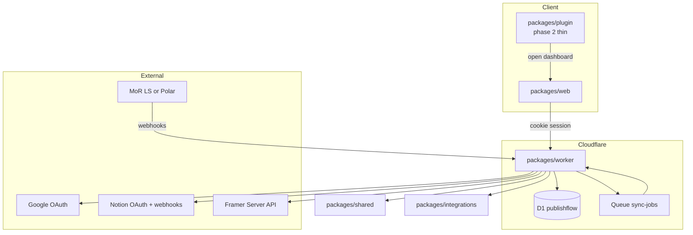
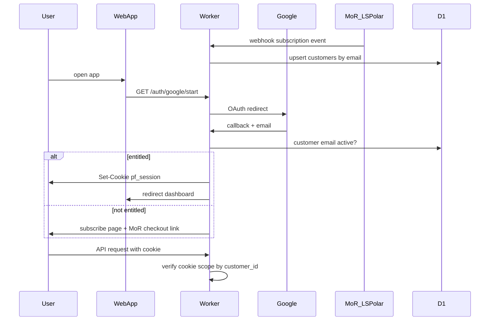
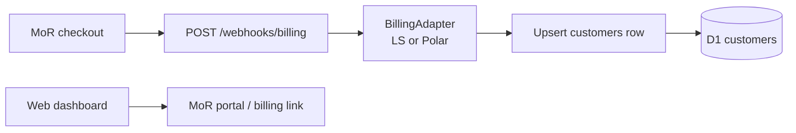

# NoCMS pivot

NoCMS is a calm publishing workflow for Framer creators: connect a content source (Notion first), map fields, and let the backend keep Framer CMS in sync with optional auto-publish.

This document describes the **target architecture** after the Kitful-style pivot. The current codebase on `main` still matches the pre-pivot plugin wizard — see [ARCHITECTURE.md](./ARCHITECTURE.md) for that.

**Reference product:** [Kitful Framer integration](https://docs.kitful.ai/integrations/framer) — plugin connects; all publishing happens from the dashboard.

**Your action items (consoles, secrets, MoR):** [MANUAL_CHECKLIST.md](./MANUAL_CHECKLIST.md)

---

## Product vision

| Surface | Role |
| ------- | ---- |
| **Web app** (`packages/web`) | Product: login, setup, field mapping, sync status, publish controls |
| **Worker** (`packages/worker`) | API, Google + Notion OAuth, billing webhooks, sync queue, D1 |
| **Shared** (`packages/shared`) | Types, transforms, session signing |
| **Integrations** (`packages/integrations`) | Provider adapters (Notion v1; Airtable/Sheets stubs later) |
| **Framer plugin** (phase 2) | Thin connector: Connect → open web dashboard. No full wizard. |

**User journey (target):**

1. Purchase NoCMS via **MoR checkout** (Lemon Squeezy or Polar — TBD).
2. Open the web app → **Continue with Google** (Kitful-style gate on first visit).
3. Connect Notion, map fields, link Framer project + Server API key — all in the dashboard.
4. Edit content in Notion → webhook → queued sync → Framer CMS updates.
5. In Framer: install plugin only to connect workspace / open dashboard (phase 2).

Publishing and setup do **not** happen inside the plugin UI.

---

## Billing provider (TBD)

Applying to **both** Lemon Squeezy and Polar for Merchant of Record approval. Pick one after comparing approval, fees, and checkout UX.

| | Lemon Squeezy | Polar |
| --- | --- | --- |
| **MoR** | Yes | Yes |
| **Webhooks** | `X-Signature` HMAC on raw body | Standard Webhooks spec |
| **Portal** | Built-in Customer Portal + signed URLs | Subscription/customer APIs |
| **V1 fit** | Simple subscription SaaS | Dev-first; TS SDK |

**Code strategy:** provider-neutral `customers` table + thin **billing adapter** in the worker (`lemon_squeezy` \| `polar`). Webhook route: `POST /webhooks/billing`. Do **not** implement provider-specific handlers until MoR is chosen — schema and auth can proceed first.

---

## Package map

---

## Auth and billing stack

Login and billing are **separate layers**. The MoR is not the login provider.

| Layer | Provider | Responsibility |
| ----- | -------- | -------------- |
| **User identity** | Google Cloud OAuth (Worker) | "Continue with Google" on web app open |
| **Session** | Worker (HMAC signed httpOnly cookie) | `pf_session` — no Firebase, Clerk, or Auth0 |
| **Entitlements** | MoR webhooks → D1 | `customers.subscription_status` by purchase email |
| **Billing self-service** | MoR customer portal / API | Checkout + manage subscription link in dashboard |
| **Source connection** | Notion OAuth (Worker) | Connect Notion in dashboard — separate from user login |

### Explicitly not using

- Firebase Auth (avoid extra weight on Worker; no magic link in v1)
- Clerk / Auth0
- License key as login (legacy V1 dev flow only until removed)
- Google login button inside the Framer plugin (web only)

---

## Auth flow

**Implementation pattern:** mirror existing Notion OAuth in [`packages/worker/src/oauth/notion.ts`](../packages/worker/src/oauth/notion.ts) — redirect, code exchange, callback. Outcome is a signed cookie instead of a setup-session token.

**Session token:** HMAC-signed payload `{ customerId, email, exp }` — same approach as [`packages/shared/src/license.ts`](../packages/shared/src/license.ts). Cookie name: `pf_session`.

**Entitlement check:** On Google callback, look up `customers` by email. Require `subscription_status = 'active'` unless `AUTH_DEV_ALLOW_ANY=true` (dev only — remove in production).

**Email mismatch:** User must sign in with the same email used at checkout. No account linking UX in v1.

---

## Billing flow (MoR adapter)

**Adapter interface (worker):**

- `verifyWebhook(request)` — provider-specific signature
- `parseSubscriptionEvent(payload)` → `{ email, externalCustomerId, externalSubscriptionId, status }`
- `getBillingPortalUrl(customer)` — optional; LS signed URL vs Polar API

**Lemon Squeezy (if chosen):** subscription product, license keys off; events `order_created`, `subscription_*`; `X-Signature` verification.

**Polar (if chosen):** Standard Webhooks headers; subscription lifecycle events; see [Polar webhook docs](https://polar.sh/docs/integrate/webhooks/endpoints).

---

## Cookie and domain strategy

Google OAuth cookies require the **login page and API to share an origin** (or a parent cookie domain).

| Stage | Hosting | Notes |
| ----- | ------- | ----- |
| **Dogfood (now)** | `*.workers.dev` | Serve `packages/web` from the **same Worker hostname** (Wrangler `[assets]` or Pages `_worker.js` on one hostname). Do not split web on `pages.dev` and API on `workers.dev` — cross-origin cookies will not work. |
| **Production (phase 3)** | Custom domain | e.g. `app.nocms.com` + `api.nocms.com` with cookie `Domain=.nocms.com`. Update Google OAuth redirect URIs when switching. |

API client in web app uses `fetch(..., { credentials: 'include' })`.

---

## D1 schema (target)

New database `publishflow`. Single migration [`packages/worker/migrations/0001_initial.sql`](../packages/worker/migrations/0001_initial.sql). **Do not** append to old migrations `0001`–`0005` on the existing D1 (`fee996ec-...`).

### Tables

| Table | Purpose |
| ----- | ------- |
| `customers` | `id`, `email` (unique), `billing_provider` (`lemon_squeezy` \| `polar` \| `manual`), `external_customer_id`, `external_subscription_id`, `subscription_status`, timestamps |
| `projects` | `customer_id` FK, `framer_project_url`, `framer_collection_id`, `source_provider` (e.g. `notion`), `source_data_source_id`, `source_database_id`, `source_title`, slug field, auto_sync/publish flags |
| `secrets` | Encrypted source token, Framer API key, webhook verification token |
| `field_mappings` | Generic `source_property_*` → `framer_field_*` |
| `sync_state` | Last sync, error, item count |
| `webhook_subscriptions` | Per-project source webhook status |
| `connect_sessions` | Short-lived Framer plugin connect flow |
| `debounce_sync` | Webhook debounce schedule |

**Removed from projects:** `license_key_hash`, `license_status` (replaced by customer subscription).

Phase **1A can start before MoR is chosen** — `customers` is provider-neutral.

---

## Sync pipeline (unchanged core)

Reuse ~70–80% of current sync code:

- [`runSync.ts`](../packages/worker/src/sync/runSync.ts), [`framerCollection.ts`](../packages/worker/src/sync/framerCollection.ts), [`publishAfterSync.ts`](../packages/worker/src/sync/publishAfterSync.ts)
- Notion fetch/transforms in [`packages/shared`](../packages/shared)
- Webhook debounce + cron in [`webhooks/notion.ts`](../packages/worker/src/webhooks/notion.ts)

**New in phase 1C:** Cloudflare Queue `sync-jobs` — webhooks and cron enqueue; consumer runs `runSync` (avoids `waitUntil` timeout on heavy syncs).

**Unchanged principle:** all CMS writes via [Framer Server API](https://www.framer.com/developers/server-api-introduction). See [SERVER_API_SPIKE.md](./SERVER_API_SPIKE.md).

---

## Roadmap

One list. Two tracks: **you** (dashboards) vs **code** (repo). Do them in order.

| **2** | **You** | **Google Cloud OAuth** | Done |
| **3** | You | Payments (Polar / LS) | When approved |
| **4** | Code | New database + worker DB layer | Done |
| **5** | Code | Google login routes + session cookie | Done |
| **6** | Code | Web dashboard | **← Next** |
| **7** | Code | Deploy, test, thin plugin | Not started |

**Later (not blocking MVP):** sync queue, custom domain, more content sources (Airtable), marketplace resubmit.

### Step 2 — Google Cloud OAuth (you, now)

No code needed. Full click-by-click: [MANUAL_CHECKLIST.md](./MANUAL_CHECKLIST.md#step-2--google-cloud-oauth-you-now).

When done, paste Client ID + Secret into `packages/worker/.dev.vars` and stop — login routes do not exist yet.

### Step 3 — Payments (you, when approved)

MoR product + webhook URL. Blocked until Polar/LS approves you. Code for webhooks comes in **Step 5**.

### Steps 4–7 — Code (agent / you in repo)

Do not start Step 4 until Step 2 is done. Do not start Step 5 until Step 4 is done and you have picked a payments provider.

---

## Old phase labels (deprecated)

If you see `0a`, `1A`, `1D` in old notes: ignore them. Use the Step 1–7 table above.

| Old label | Means |
| --------- | ----- |
| 0a / Phase 0 | Step 2 + optional D1 create before Step 4 |
| 0b | Step 3 |
| 1A | Step 4 |
| 1D | Step 5 |
| 1E | Step 6 |
| 1F / Phase 2 | Step 7 |

---

## Environment variables

| Variable | Purpose |
| -------- | ------- |
| `GOOGLE_CLIENT_ID` | Google OAuth client ID |
| `GOOGLE_CLIENT_SECRET` | Google OAuth client secret |
| `GOOGLE_REDIRECT_URI` | e.g. `{WORKER_URL}/auth/google/callback` |
| `SESSION_SIGNING_SECRET` | Cookie HMAC for `pf_session` |
| `BILLING_PROVIDER` | `lemon_squeezy` or `polar` |
| `BILLING_WEBHOOK_SECRET` | MoR webhook signing secret |
| `BILLING_CHECKOUT_URL` | MoR product checkout link (subscribe page) |
| `WEB_APP_URL` | Post-login redirect base |
| `AUTH_DEV_ALLOW_ANY` | Dev only: allow any Google email without active subscription |
| `NOTION_CLIENT_ID` / `NOTION_CLIENT_SECRET` | Notion source OAuth (unchanged) |
| `NOTION_REDIRECT_URI` | Notion callback (unchanged) |
| `ENCRYPTION_KEY` | Encrypt tokens in D1 (unchanged) |
| `WORKER_PUBLIC_URL` | Public worker base URL |

---

## Non-goals

- One-collection sync by plugin slot id (Server API cannot target plugin-created collections — see [SERVER_API_SPIKE.md](./SERVER_API_SPIKE.md))
- Plugin-side CMS writes for webhooks
- Append migrations on the old dirty D1
- Firebase / Firestore
- Separate Workers per integration
- License-key login for dashboard access
- Marketplace plugin resubmit before web MVP dogfood
- Implementing both MoR adapters in v1 — only the chosen provider

---

## Success criteria (before phase 2)

- [ ] MoR test purchase → webhook → `customers` row
- [ ] Open web → Google login → dashboard
- [ ] Wrong email / no subscription → subscribe prompt
- [ ] Unauthenticated API access rejected
- [ ] Notion edit → queued sync → Framer CMS updates
- [ ] Plugin only opens web / minimal connect

---

## Related docs

- [MANUAL_CHECKLIST.md](./MANUAL_CHECKLIST.md) — **what you do in dashboards after code lands**
- [ARCHITECTURE.md](./ARCHITECTURE.md) — current pre-pivot V1 (plugin wizard)
- [SERVER_API_SPIKE.md](./SERVER_API_SPIKE.md) — why Server API owns the CMS collection
- [ERROR_BOUNDARIES.md](./ERROR_BOUNDARIES.md) — sync error codes (still relevant)
- [README.md](../README.md) — install and dev commands
