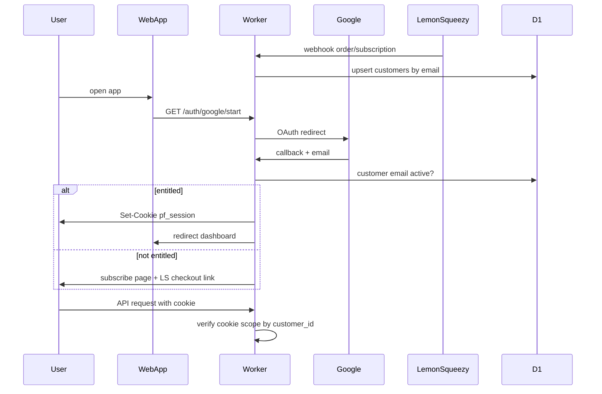
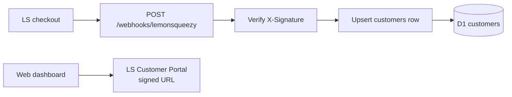

# PublishFlow pivot

PublishFlow is a calm publishing workflow for Framer creators: connect a content source (Notion first), map fields, and let the backend keep Framer CMS in sync with optional auto-publish.

This document describes the **target architecture** after the Kitful-style pivot. The current codebase on `main` still matches the pre-pivot plugin wizard — see [ARCHITECTURE.md](./ARCHITECTURE.md) for that.

**Reference product:** [Kitful Framer integration](https://docs.kitful.ai/integrations/framer) — plugin connects; all publishing happens from the dashboard.

---

## Product vision

| Surface | Role |
| ------- | ---- |
| **Web app** (`packages/web`) | Product: login, setup, field mapping, sync status, publish controls |
| **Worker** (`packages/worker`) | API, Google + Notion OAuth, LS webhooks, sync queue, D1 |
| **Shared** (`packages/shared`) | Types, transforms, session signing |
| **Integrations** (`packages/integrations`) | Provider adapters (Notion v1; Airtable/Sheets stubs later) |
| **Framer plugin** (phase 2) | Thin connector: Connect → open web dashboard. No full wizard. |

**User journey (target):**

1. Purchase PublishFlow on Lemon Squeezy.
2. Open the web app → **Continue with Google** (Kitful-style gate on first visit).
3. Connect Notion, map fields, link Framer project + Server API key — all in the dashboard.
4. Edit content in Notion → webhook → queued sync → Framer CMS updates.
5. In Framer: install plugin only to connect workspace / open dashboard (phase 2).

Publishing and setup do **not** happen inside the plugin UI.

---

## Package map

---

## Auth and billing stack

Login and billing are **separate layers**. Lemon Squeezy is not the login provider.

| Layer | Provider | Responsibility |
| ----- | -------- | -------------- |
| **User identity** | Google Cloud OAuth (Worker) | "Continue with Google" on web app open |
| **Session** | Worker (HMAC signed httpOnly cookie) | `pf_session` — no Firebase, Clerk, or Auth0 |
| **Entitlements** | Lemon Squeezy webhooks → D1 | `customers.subscription_status` by purchase email |
| **Billing self-service** | LS Customer Portal | Signed URL from LS API; not custom billing UI |
| **Source connection** | Notion OAuth (Worker) | Connect Notion in dashboard — separate from user login |

### Explicitly not using

- Firebase Auth (avoid extra weight on Worker; no magic link in v1)
- Clerk / Auth0
- License key as login (legacy V1 dev flow only until removed)
- Google login button inside the Framer plugin (web only)

---

## Auth flow

**Implementation pattern:** mirror existing Notion OAuth in [`packages/worker/src/oauth/notion.ts`](../packages/worker/src/oauth/notion.ts) — redirect, code exchange, callback. Outcome is a signed cookie instead of a setup-session token.

**Session token:** HMAC-signed payload `{ customerId, email, exp }` — same approach as [`packages/shared/src/license.ts`](../packages/shared/src/license.ts). Cookie name: `pf_session`. Optional dedicated `SESSION_SIGNING_SECRET`; may reuse `LICENSE_SIGNING_SECRET` until license auth is removed.

**Entitlement check:** On Google callback, look up `customers` by email. Require `subscription_status = 'active'` unless `AUTH_DEV_ALLOW_ANY=true` (dev only — remove in production).

**Email mismatch:** User must sign in with the same email used at LS checkout. No account linking UX in v1.

---

## Billing flow (Lemon Squeezy)

- **Product:** subscription; **license keys disabled** on the LS product.
- **Webhook events (minimum):** `order_created`, `subscription_created`, `subscription_updated`, `subscription_expired`.
- **Stored fields:** `email`, `ls_customer_id`, `ls_subscription_id`, `subscription_status`.
- **Manage subscription:** retrieve Customer Portal signed URL from LS API when user clicks "Billing" in dashboard.

---

## Cookie and domain strategy

Google OAuth cookies require the **login page and API to share an origin** (or a parent cookie domain).

| Stage | Hosting | Notes |
| ----- | ------- | ----- |
| **Dogfood (now)** | `*.workers.dev` | Serve `packages/web` from the **same Worker hostname** (Wrangler `[assets]` or Pages `_worker.js` on one hostname). Do not split web on `pages.dev` and API on `workers.dev` — cross-origin cookies will not work. |
| **Production (phase 3)** | Custom domain | e.g. `app.publishflow.com` + `api.publishflow.com` with cookie `Domain=.publishflow.com`. Update Google OAuth redirect URIs when switching. |

API client in web app uses `fetch(..., { credentials: 'include' })`.

---

## D1 schema (target)

New database `publishflow`. Single migration [`packages/worker/migrations/0001_initial.sql`](../packages/worker/migrations/0001_initial.sql). **Do not** append to old migrations `0001`–`0005` on the existing D1 (`fee996ec-...`).

### Tables

| Table | Purpose |
| ----- | ------- |
| `customers` | `id`, `email` (unique), `ls_customer_id`, `ls_subscription_id`, `subscription_status`, timestamps |
| `projects` | `customer_id` FK, `framer_project_url`, `framer_collection_id`, `source_provider` (e.g. `notion`), `source_data_source_id`, `source_database_id`, `source_title`, slug field, auto_sync/publish flags |
| `secrets` | Encrypted Notion token, Framer API key, webhook verification token |
| `field_mappings` | Generic `source_property_*` → `framer_field_*` |
| `sync_state` | Last sync, error, item count |
| `webhook_subscriptions` | Per-project source webhook status |
| `connect_sessions` | Short-lived Framer plugin connect flow |
| `debounce_sync` | Webhook debounce schedule |

**Removed from projects:** `license_key_hash`, `license_status` (replaced by customer subscription).

---

## Sync pipeline (unchanged core)

Reuse ~70–80% of current sync code:

- [`runSync.ts`](../packages/worker/src/sync/runSync.ts), [`framerCollection.ts`](../packages/worker/src/sync/framerCollection.ts), [`publishAfterSync.ts`](../packages/worker/src/sync/publishAfterSync.ts)
- Notion fetch/transforms in [`packages/shared`](../packages/shared)
- Webhook debounce + cron in [`webhooks/notion.ts`](../packages/worker/src/webhooks/notion.ts)

**New in phase 1C:** Cloudflare Queue `sync-jobs` — webhooks and cron enqueue; consumer runs `runSync` (avoids `waitUntil` timeout on heavy syncs).

**Unchanged principle:** all CMS writes via [Framer Server API](https://www.framer.com/developers/server-api-introduction). See [SERVER_API_SPIKE.md](./SERVER_API_SPIKE.md).

---

## Phased execution

### Phase 0 — Infra prep

- [ ] Create D1 database `publishflow`; update [`wrangler.toml`](../packages/worker/wrangler.toml)
- [ ] LS product (subscription, license keys off), webhook URL + signing secret
- [ ] Google Cloud OAuth client; redirect `{WORKER_URL}/auth/google/callback`
- [ ] Delete old migrations `0001`–`0005` when applying new schema
- [ ] Document env vars in `packages/worker/.dev.vars.example`

### Phase 1A — Schema + DB layer

- [ ] Write `0001_initial.sql`
- [ ] Rewrite `packages/worker/src/db/*` + `packages/shared/src/types.ts`

### Phase 1B — Provider modularization

- [ ] Add `packages/integrations` (core + notion + stubs)
- [ ] Generic connect/sources API routes; refactor `buildPayload.ts`

### Phase 1C — Sync queue

- [ ] Queue binding + consumer for `runSync`

### Phase 1D — Auth + billing

- [ ] `oauth/google.ts`, `shared/session.ts`, auth middleware
- [ ] `POST /webhooks/lemonsqueezy`
- [ ] Protect `/api/projects/*`; CORS allowlist

### Phase 1E — Web app

- [ ] `packages/web` — login page + dashboard (port plugin UI)
- [ ] Same-origin with Worker for dogfood

### Phase 1F — Deploy + dogfood

- [ ] Remote D1, deploy, end-to-end test, retire old D1

### Phase 2 — Thin plugin + marketplace

- [ ] Plugin: Connect + open dashboard only
- [ ] Do not resubmit marketplace until web MVP works

### Phase 3 — Post-launch

- [ ] Custom domain + cookie domain
- [ ] LS Customer Portal link in settings
- [ ] PATCH projects, Airtable/Sheets stubs, Notion webhook signature verification

---

## Environment variables

| Variable | Purpose |
| -------- | ------- |
| `GOOGLE_CLIENT_ID` | Google OAuth client ID |
| `GOOGLE_CLIENT_SECRET` | Google OAuth client secret |
| `GOOGLE_REDIRECT_URI` | e.g. `{WORKER_URL}/auth/google/callback` |
| `SESSION_SIGNING_SECRET` | Cookie HMAC (or reuse `LICENSE_SIGNING_SECRET` until license auth removed) |
| `LEMONSQUEEZY_WEBHOOK_SECRET` | Verify LS webhook signatures |
| `WEB_APP_URL` | Post-login redirect base |
| `AUTH_DEV_ALLOW_ANY` | Dev only: allow any Google email without active subscription |
| `NOTION_CLIENT_ID` / `NOTION_CLIENT_SECRET` | Notion source OAuth (unchanged) |
| `NOTION_REDIRECT_URI` | Notion callback (unchanged) |
| `ENCRYPTION_KEY` | Encrypt tokens in D1 (unchanged) |
| `WORKER_PUBLIC_URL` | Public worker base URL |

---

## Non-goals

- One-collection sync by plugin slot id (Server API cannot target plugin-created collections — see [SERVER_API_SPIKE.md](./SERVER_API_SPIKE.md))
- Plugin-side CMS writes for webhooks
- Append migrations on the old dirty D1
- Firebase / Firestore
- Separate Workers per integration
- License-key login for dashboard access
- Marketplace plugin resubmit before web MVP dogfood

---

## Success criteria (before phase 2)

- [ ] LS purchase → webhook → `customers` row
- [ ] Open web → Google login → dashboard
- [ ] Wrong email / no subscription → subscribe prompt
- [ ] Unauthenticated API access rejected
- [ ] Notion edit → queued sync → Framer CMS updates
- [ ] Plugin only opens web / minimal connect

---

## Related docs

- [ARCHITECTURE.md](./ARCHITECTURE.md) — current pre-pivot V1 (plugin wizard)
- [SERVER_API_SPIKE.md](./SERVER_API_SPIKE.md) — why Server API owns the CMS collection
- [ERROR_BOUNDARIES.md](./ERROR_BOUNDARIES.md) — sync error codes (still relevant)
- [README.md](../README.md) — install and dev commands
